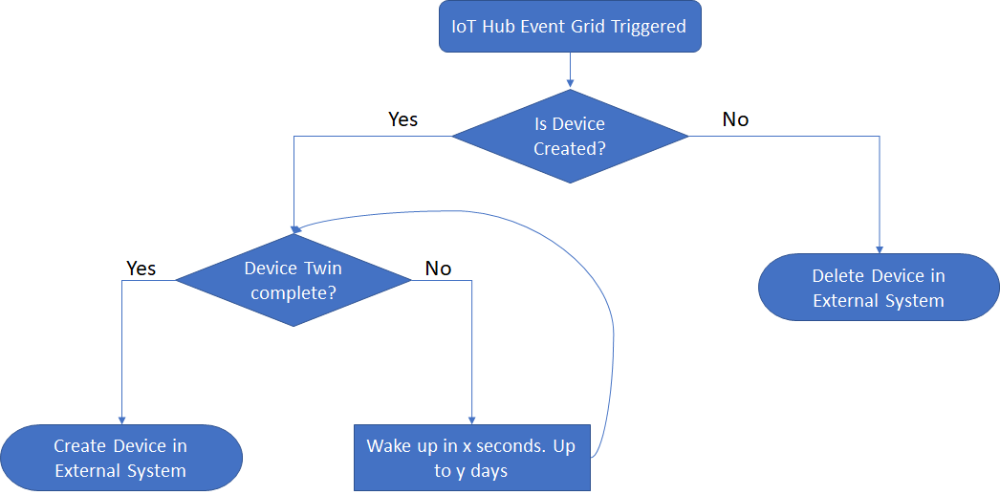

# IoT Hub Device Synchronizer
This repository contains a sample implementation to synchronize IoT devices between Azure IoT Hub and an external system. It supports having either side as master device registry.

## Scenario


This solution targets scenarios where a network service sits between IoT devices and Azure IoT Hub. Both ends, the network service and IoT Hub, must know the connected devices in order to provide proper device authentication (only registered devices allowed). A typical scenario is found in LoRaWAN based solutions, where a network provider will sit between devices and Azure IoT Hub.

There are a few solutions to this problem based on how the synchronization happens and who takes the role of master device registry.

|Solution|Master Registry|How it works|Pros|Cons|In this Sample|
|-|-|-|-|-|-|
|Manual synchronization|Both|The end customer must create or delete the devices manually in both registry|<ul><li>No additional components needs to be deployed on the end customer Azure subscription.</li><li>No additional configuration</li><li>Secure</li></ul>|Error prone manual work. Would work only for small implementations like up to 100 devices|No|
|Just-in-time device provision|Network Provider|Network Provider create devices just-in-time, when first message arrives | <ul><li>No additional components needs to be deployed on the end customer Azure subscription</li><li>No additional configuration</li><li>Scalable, doing on the first message will avoid hitting the IoT Hub registry with a job so probably never incurring in throttling, registry access is throttled more aggressively that device communication</li><ul>| The network provider has full registry access to the end customer IoT Hub. This is not acceptable in term of security by most end customers. Not ideal in case IoT Hub also has devices outside the network provider scope. Full access to IoT Hub can be replaced with a device create/delete Fa�ade |Yes, Fa�ade functions to add/remove devices in IoT Hub|
|Scheduled synchronization|Network Provider|Synchronization happens on a schedule base|<ul><li>Network Server owner has no access to the end customer IoT Hub registry.</li><li>End customer works with Network Provider device registry and does not need to manage the IoT Hub one. Good if all devices are connected through the network server.</li><li>No need to enter information on the device twin</li>|<ul><li>An Azure Durable Function solution needs to be deployed and configured, adding complexity and additional maintenance.</li><li>Synchronization is batch based on a scheduled so there is a waiting time between sync is done. A manual trigger is possible from the Azure portal.</li><li>Being a batch solution you will incur in device registry throttling (even when using the Bulk import feature of IoT Hub) so the scalability of the synchronization is also dictated by the IoT Hub instance type.</li></ul>|Yes|
|IoT Hub as master with real-time synchronization|IoT Hub|Device changes are automatically sent to network provider using IoT Hub built-in event grid triggers|<ul><li>Network Server owner has no access to the end customer IoT Hub registry.</li><li>End customer works on a single registry for all his devices.</li><li>Scalable, doing on the first device creation will avoid hitting the IoT Hub registry with a job so probably less prone to incur in throttling, registry access is throttled more aggressively that device communication.</li></ul>|<ul><li>An Azure Function using EventGrid needs to be deployed and configured on Azure</li><li>All required device properties that Network provider registry needs must be entered on the device twin for every device in IoT Hub</li><li>End customer must be careful and never create devices in the Network provider registry.</li></ul>|Yes|

## Implementation choice - Durable Functions

The implementation found in this repository is using [Durable Functions](https://docs.microsoft.com/en-us/azure/azure-functions/durable-functions-overview) which is part of the serverless offers in Azure. Serverless is a good fit for this problem because the solution reacts to events happening in the system (device created/deleted, timed synchronization). Using standard Azure Functions to solve the problem was not ideal due to the fact that this workflow can span a few minutes/hours depending on the availability of the downstream system and/or the amount of events/devices being synchronized. Durable functions address these problems by allowing the orchestration of small activities with built-in support to retries with exponential back-off retries.

## Just-in-time device provision

Opting for just-in-time device provision requires the network service to take an action whenever sending a message to IoT Hub fails to due to "unknown device" errors. The less secure solution relies in giving them full access to the target IoT Hub, which is not acceptable in most scenarios. A way to protect IoT Hub is providing a Façade used by the provider, thus protecting the underlying Azure IoT Hub. The sample project has a façade implementation to create and delete devices in an IoT Hub.

Uri to create devices: POST https://xxxx/api/devices/{iothubname?}/{deviceId}

Uri to delete devices: DELETE https://xxxx/api/devices/{iothubname?}/{deviceId}

To support multiple IoT Hubs add each connected IoT Hub connection string as an application setting, having the key with the format ```iothub_<iot-hub-name-goes-here>```

## Scheduled Synchronization

This solution is implemented as a durable function taking advantage of IoT Hub import/export device jobs. It collects all devices from both registries, creates a delta file and then submits as an import job to IoT Hub. The reason where are using durable functions is to be able to run for a longer time (iothub export job, collection external devices, comparing, iothub import job).


## IoT Hub with real-time synchronization

This solution relies on Event Grid events from IoT Hub to act upon device creation or removal. An Azure Function subscriber reacts based on the triggered event type. Creating devices might require additional work since the network provider could require specific device information as part of the device registration. 

This sample implementation relies on this information being set in the IoT Hub device twin tags. If the required information is available at the time of the event grid notification (device twin properties are part of the payload) the device will be created without requiring any complex workflow. In case the device twin is incomplete (i.e creating the device from Azure Portal) a durable functions is started to continue validating the twin properties, creating the device once all properties are available or a timeout is reached.



## Adding support to another external system

The current implementation only supports Actility as an external device registry provider. To add a new one the following changes have to be made:

1. Create a new implementation of ```IExternalDeviceRegistryService``` interface
1. Modify the Utils class, adding the new external system
```C#
static Lazy<IExternalDeviceRegistryService> externalDeviceRegistry = new Lazy<IExternalDeviceRegistryService>(() =>
{
    switch (Settings.Instance.ExternalSystemName.ToLowerInvariant())
    {
        case "actility":
            return new ActilityExternalDeviceRegistryService();

        case "set-the-name-here":
            return new MyExternalDeviceRegistryService();

        default:
            throw new Exception($"Unknown external system '{Settings.Instance.ExternalSystemName}'");
    }

});
```
3. Set the Application Settings property ```externalSystemName``` accordingly

## Customizing the Azure Function

Customizing the sample implementation is possible through the following Application Settings:

|Setting|Description|Default|Example|
|-|-|-|-|
|iothub|Default IoT Hub connection string where devices will be created|||
|iothub_&lt;iot-hub-name&gt;|Specific IoT Hub connection string, if you need to support multiple|||
|twinCheckIntervalInSeconds|Interval in seconds in which iot hub device twin will be checked for completeness|60|60|
|twinCheckMaxIntervalInSeconds|Indicates the device twin check maximum interval in seconds|5 minutes|300|
|twinCheckMaxRetryCount|Indicates the device twin check maximum retry counts|100|100|
|twinCheckRetryTimeoutInMinutes|Indicates the device twin check retry timeout, in other words, how long it will keep trying at most|2 days|2880|
|AzureWebJobsStorage|Storage account where IoT Hub jobs and intermediate files will be stored. Automatically created during deployment to Azure|||
|storage|Alternative storage account, in case AzureWebJobsStorage is empty or is set for debug "UseDevelopmentStorage=true"|||
|externalSystemName|Name of the external system. Used to resolve ```IExternalDeviceRegistryService```|Actility|Actility|
|iothubfacadeEnabled|Enables/disabled IoT Hub create/delete façade|true|true or false|
|iotHubFacadeUseSoftDelete|Enables/disabled IoT Hub façade soft deletes. If enabled the fa�ade delete will disable the device instead of delete it |false|true or false|
|retryIntervalForIoTHubExportJobInSeconds|Internal time (in seconds) between each IoT Hub Export jobs completion check|60|Desired interval in seconds|
|retryAttemptsForIoTHubExportJob|Maximum amount of attempts to wait for IoT Hub Export job to complete|5|Desired attempts count|
|retryIntervalForIoTHubImportJobInSeconds|Internal time (in seconds) between each IoT Hub Import jobs completion check|300 (5 minutes)|Desired interval in seconds|
|retryAttemptsForIoTHubImportJob|Maximum amount of attempts to wait for IoT Hub Import job to complete|5|Desired attempts count|
|ioTHubSynchronizerEnabled|Enables/disables synchronization to IoT Hub. It is better to actually disable the function so that timer triggers won't execute|true|true or false|
|devicesChangeJobThreshold|The threshold in which device synchronization will use iot hub jobs.|100|To always use jobs define as 0|
|externalSystemCallRetryIntervalInSeconds|Indicates the retry interval for external system calls to create/delete devices. Value in seconds|5 minutes|Amount of seconds|
|externalSystemCallMaxRetryCount|Indicates the maximum retry count for external system calls to create/delete devices.|100|Maximum retries|
|externalSystemCallMaxIntervalInSeconds|Indicates the maximum retry interval for external system calls to create/delete devices. Value is set in seconds|30 minutes|amount of seconds|
|externalSystemCallRetryTimeoutInMinutes|Indicates the maximum total amount of time for external system calls retries. Value in minutes|1 day|amount of minutes|
|APPINSIGHTS_INSTRUMENTATIONKEY|Application Insights instrumentation key. Strongly recommended to provide as this sample uses custom events to notify device operations||

### Actility properties

In order to use connect to Actility the following application settings must be provided:

|Setting|Description|Example|
|-|-|-|-|
|actility_api_token_uri|Uri for token creation|https://dx-api.thingpark.com/admin/latest/api/oauth/token|
|actility_api_devices_uri|Uri for devices|https://dx-api.thingpark.com/core/latest/api/devices|
|actility_api_client_id|Client ID to be used for authentication|Value provided by Actility|
|actility_api_client_secret|Client secret to be used for authentication|Value provided by Actility|

## Setup: External System as Master

In this scenario we poll devices from the external system and compare with the ones existing currently in IoT Hub, then create/delete the delta.

1. Deploy the Azure Function to Azure. 
1. Set the required properties in the Azure Function application settings.\
   FUNCTIONS_EXTENSION_VERSION &rarr; ~2.0.11776 (until [this issue](https://github.com/Azure/azure-functions-durable-extension/issues/347#event-1694583724) is fully available)\
   iothub &rarr; Connection string to IoT Hub\
   All external system properties
1. Ensure that the timer Function (IoTHubSynchronizer_TimerTrigger) is enabled
1. Wait until the function triggers or start it by calling the http triggered version manually https://{your-function-deployment-name}.azurewebsites.net/api/IoTHubSynchronizer_HttpListener

## Setup: IoT Hub as Master

In this scenario we publish create/delete device events to external systems. Those events are published using IoT Hub built-in Event Grid integration.

1. Deploy the Azure Function to Azure. 
1. Set the required properties in the Azure Function application settings.\
   FUNCTIONS_EXTENSION_VERSION &rarr; ~2.0.11776 (until [this issue](https://github.com/Azure/azure-functions-durable-extension/issues/347#event-1694583724) is fully available)\
   iothub_&lt;your-master-iothub-name&gt; &rarr; Connection string to IoT Hub\
   All external system properties
1. In your IoT Hub add a subscriber to the events, setting the endpoint add a subscriptions to all events pointing to the deployed azure function https://{your-function-deployment-name}.azurewebsites.net/api/ExternalRegistrySynchronizer_EventGridListener

## Monitoring the solution

The function uses application insights custom events to notify when an device is created/deleted, among other things. It is strongly recommended to [install](https://github.com/Azure/Azure-Functions/wiki/App-Insights) Application Insights along side the Azure function.

The following custom events will be triggered:

|Event name|Triggered condition|
|-|-|
|ExternalDeviceCreated|Device is created in external system|
|ExternalDeviceCreationError|Transient error happened creating device in external system|
|ExternalDeviceCreationFailed|Failed to create the device in external system. A manual process is required|
|ExternalDeviceDeleted|Device is deleted in external system|
|ExternalDeviceDeletedError|Transient error happened deleting device in external system|
|ExternalDeviceDeleteFailed|Failed to delete the device in external system. A manual process is required|
|DeviceTwinCheckFail|Device twin check fails, indicating that the device does not have all expected properties by the external system. This is a transient error|
|DeviceTwinCheckFailed|Device twin check failed. Device will not be created in external system requiring a manual process to solve the problem|
|IoTHubJobCheckNotComplete|IoT Hub job is not yet complete, this is a transient error|
|IoTHubJobFailed|IoT Hub job failed to complete in a timely manner|
|IoTHubDeviceCreated|Device is created in IoT Hub|
|IoTHubDeviceDeleted|Device is deleted in IoT Hub|

The following query in application insights log analytics will show all the devices that failed to be created in the external system since the last 2 days
```
customEvents
| where timestamp >= ago(2d) and name == 'ExternalDeviceCreationFailed'
| project timestamp, name, deviceId=customDimensions.deviceId
| order by timestamp desc
```

### Contributors
@fbeltrao and @ronnies